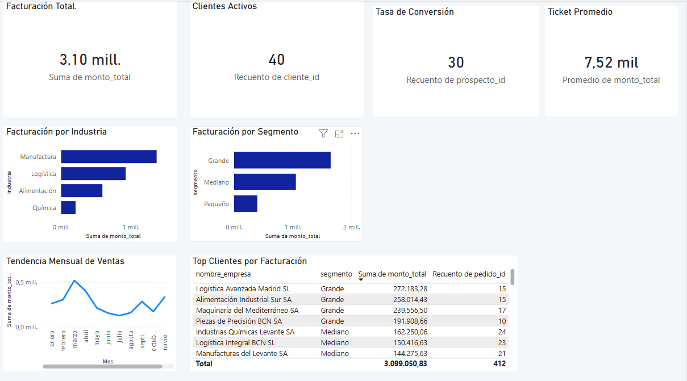
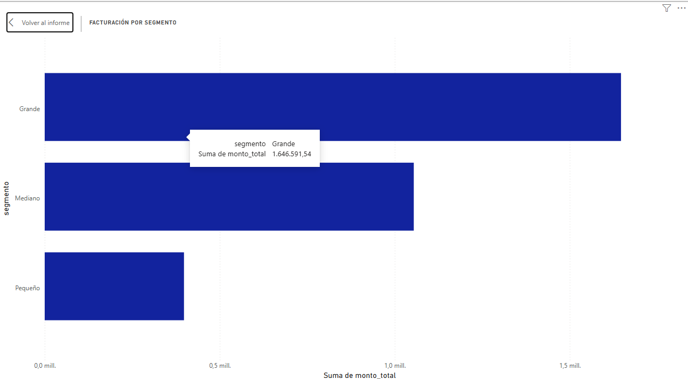
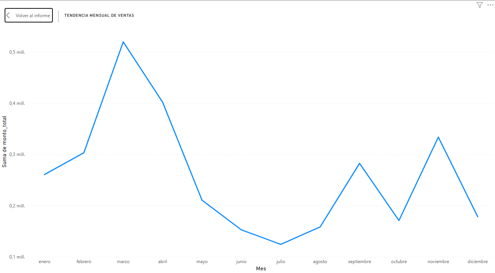

# Análisis Comercial B2B — SQL Server + Power BI 📊

## Descripción
Análisis end-to-end de una cartera de clientes B2B, desde la generación del dataset hasta el dashboard ejecutivo. Incluye segmentación de clientes, análisis RFM, cohortes de retención y tendencias de ventas.

## Dataset
Dataset sintético B2B generado en Python
- 5 tablas relacionales: clientes, productos, pedidos, detalle de pedidos, prospectos
- 1.747 registros totales

## Herramientas
- **SQL Server** — 8 queries de análisis
- **Power BI** — Dashboard interactivo
- **Python** — Generación del dataset sintético

## Análisis realizados
1. Segmentación de clientes por industria y tamaño
2. Análisis RFM (Recencia, Frecuencia, Monto)
3. Cohortes de retención
4. Tendencia mensual de ventas
5. Top clientes por facturación
6. Facturación por segmento
7. Tasa de conversión de prospectos
8. KPIs comerciales generales

## Dashboard

### Vista general

### Facturación por segmento

### Tendencia mensual de ventas

## Estructura del proyecto
- `03_queries_analisis.sql` — Queries SQL del análisis
- `clientes.csv` / `pedidos.csv` / `productos.csv` / `detalle_pedidos.csv` / `prospectos.csv` — Dataset sintético
- `dashboard_proyecto1_b2b.pbix` — Archivo Power BI

## Contacto
**Lucas Espinosa** — Data Analyst
[LinkedIn](https://linkedin.com/in/lucasespinosaa) · lucaseespinosa93@gmail.com · [github.com/lucasees](https://github.com/lucasees)
